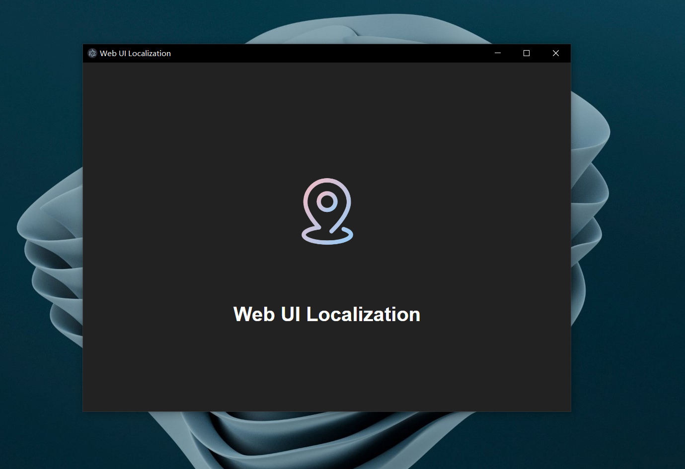

# localization-webui

> Fast to localize Web UI by using electron.

A simplest framework to make your web page localization.

## Usage

```shell
# Modify local.config.json, then run the command:
npm run build
npm run serve
```

Then, you will get:

